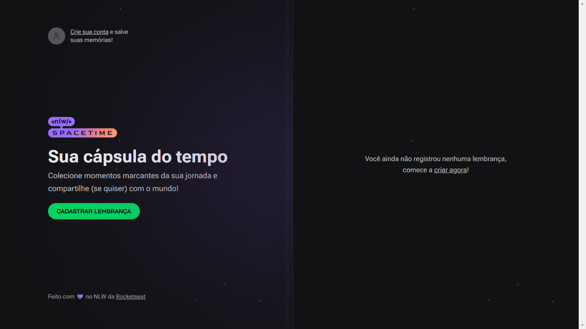
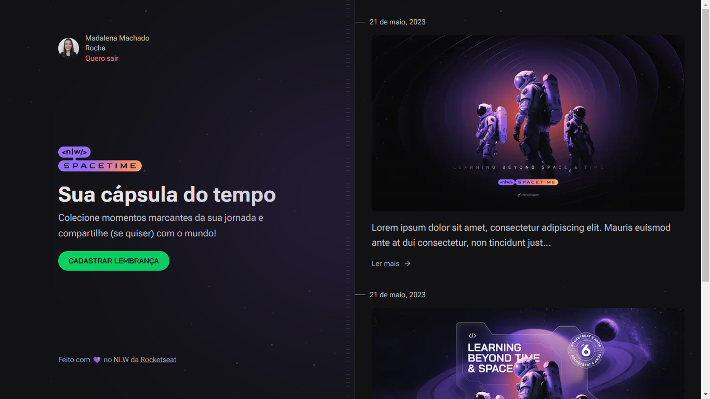
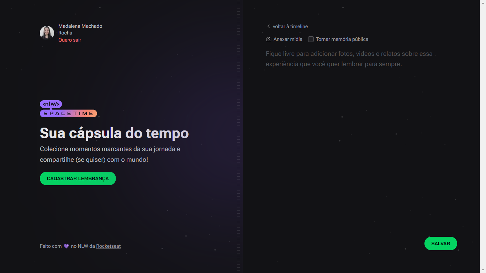
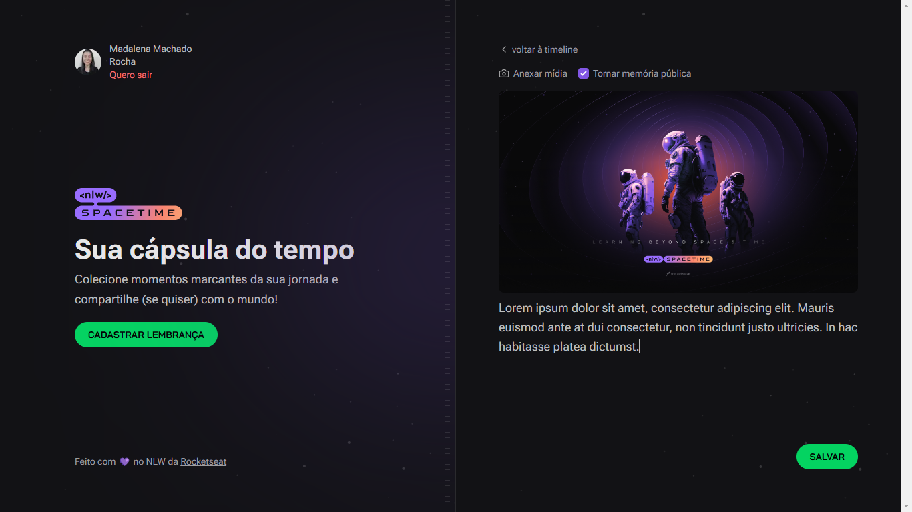
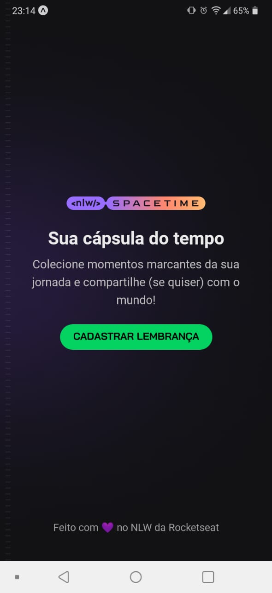
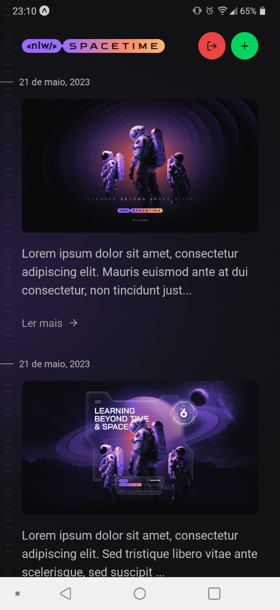
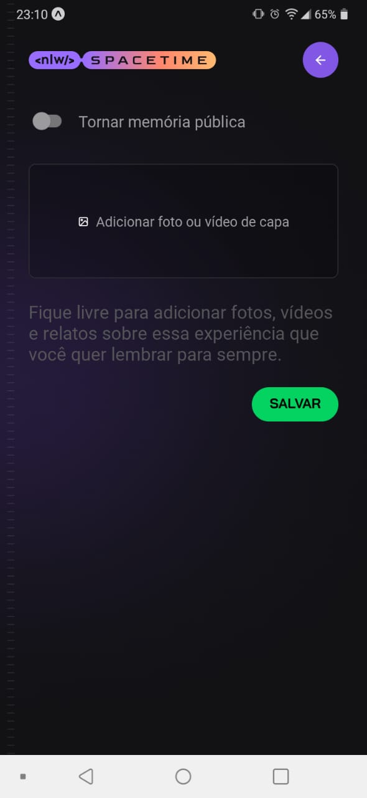
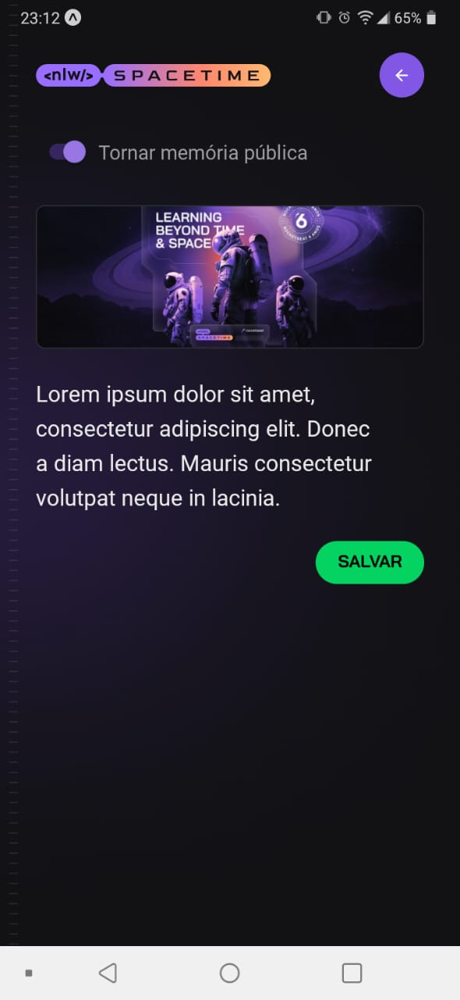

<h1 align="center"> NLW Spacetime </h1>

> Sua cápsula do tempo

<p align="center">
  <a href="#project">Projeto</a>&nbsp;&nbsp;&nbsp;|&nbsp;&nbsp;&nbsp;
  <a href="#pages">Páginas</a>&nbsp;&nbsp;&nbsp;|&nbsp;&nbsp;&nbsp;
  <a href="#features">Funcionalidades</a>&nbsp;&nbsp;&nbsp;|&nbsp;&nbsp;&nbsp;
  <a href="#technologies">Tecnologias</a>&nbsp;&nbsp;&nbsp;|&nbsp;&nbsp;&nbsp;
  <a href="#usage">Utilização</a>&nbsp;&nbsp;&nbsp;|&nbsp;&nbsp;&nbsp;
  <a href="#license">Licença</a>
</p>

<p align="center">
  
</p>

<h2 id="project">📁 Projeto</h2>

Projeto desenvolvido na trilha Ignite da 12ª edição da Next Level Week - NLW Spacetime da Rocketseat.

<h2 id="pages">📃 Páginas</h2>

<h3 align="center">Desktop</h3>

<div style="display: flex;" align="center">
    
    
    
    
</div>

<h3 align="center">Mobile</h3>

<div style="display: flex;" align="center">
    
    
    
    
</div>

<h2 id="features">🛠️ Funcionalidades</h2>

A aplicação apresenta as seguintes funcionalidades:

- Login;
- Cadastro;
- Exibir memórias;
- Cadastrar memórias;
- Logout.

<h2 id="technologies">💻 Tecnologias</h2>

Este projeto foi desenvolvido com as seguintes tecnologias:

- React;
- Next.js 13;
- Next Auth;
- TailwindCSS;
- Expo;
- TypeScript;
- Node.js;
- Fastify.

<h2 id="usage">💡 Utilização</h2>

Para instalar a aplicação em sua máquina localmente, clone o projeto, acesse cada pasta, instale as dependências e inicie o servidor.

Server:

```
$ git clone https://github.com/madalena-rocha/nlw-spacetime
$ cd nlw-spacetime
$ cd server
$ npm install
$ npm run dev
```

Web:

```
$ cd -
$ cd web
$ npm install
$ npm run dev
```
Mobile:

```
$ cd -
$ cd mobile
$ npm install
$ npm start
```

⚠️ **Importante**: Ao alternar entre as aplicações web e mobile, utilize as respectivas variáveis de ambiente no arquivo .env no servidor:

```
# Github (Web)
GITHUB_CLIENT_ID=YOUR_WEB_CLIENT_ID
GITHUB_CLIENT_SECRET=YOUR_WEB_CLIENT_SECRET

# Github (Mobile)
# GITHUB_CLIENT_ID=YOUR_MOBILE_CLIENT_ID
# GITHUB_CLIENT_SECRET=YOUR_MOBILE_CLIENT_SECRET
```

<h2 id="license">📝 Licença</h2>

Esse projeto está sob a licença MIT.

---

<div style="display: flex;">
  <a href="https://www.linkedin.com/in/madalena-machado-rocha/" target="_blank"></a>
  <a href="mailto:rochamada1997m@gmail.com"></a>
  <a href="http://discordapp.com/users/827312692905377802" target="_blank"></a>
</div>
